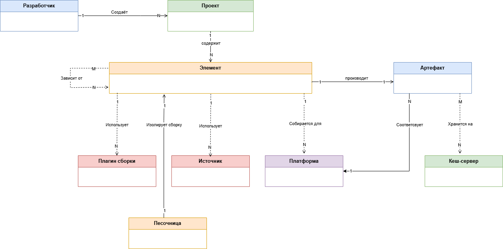
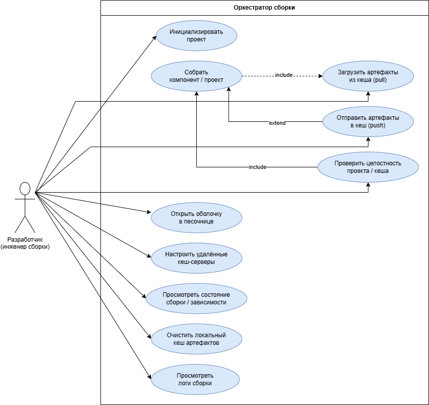

# Разработка архитектуры оркестратора сборки на примере BuildStream

## Предметная область

**Разработчик (Инженер сборки)** — физическое лицо, использующее оркестратор для сборки программных компонентов. Разработчик определяет структуру проекта (создаёт файлы .vtk), запускает процесс сборки локально или на серверах CI, управляет зависимостями и анализирует результаты. Может выступать в роли потребителя артефактов (получает готовые бинарные пакеты из кеша) или поставщика (публикует новые версии артефактов в удалённое хранилище). Имеет потребность в детерминированной и воспроизводимой среде для исключения проблем «на моей машине работает».

**Проект (Project)** — корневой репозиторий исходного кода, содержащий декларативное описание компонентов сборки (файлы .vtk и конфигурацию project.conf). Определяет глобальные зависимости и параметры окружения для всей иерархии сборки.

**Элемент (Element)** — атомарная единица сборки, описанная в файле .vtk. Соответствует отдельному программному компоненту, библиотеке или исполняемому файлу. Характеризуется набором исходного кода, зависимостями от других элементов и правилами интеграции артефактов в окружение сборки (песочницу).

**Источник (Source)** — указатель на внешний ресурс: Git-репозиторий, архив с кодом, HTTP-ссылку или локальный путь. Позволяет системе детерминированно получить состояние исходного кода по фиксированной контрольной сумме или метке времени.

**Артефакт (Artifact)** — результат успешной сборки элемента. Представляет собой неизменяемый срез файловой системы (директорию сборки), адресуемый по хешу содержимого (Content Addressable Storage - CAS).

**Песочница (Sandbox)** — изолированная среда выполнения (контейнер на базе bubblewrap или иного механизма), в которой запускаются команды сборки. Гарантирует отсутствие влияния хостовой системы и сетевых запросов (если они явно не разрешены) на воспроизводимость результата.

**Кеш-сервер (Artifact Cache)** — удаленное или локальное хранилище, реализующее протокол CAS. Используется для сохранения артефактов, чтобы избежать повторной сборки элемента при неизменных входных данных и зависимостях.

**Платформа - среда исполнения (Platform / Arch)** — совокупность архитектурных параметров (архитектура CPU, libc, целевая ОС), для которой производится сборка. Система кеширует артефакты отдельно для каждой уникальной комбинации параметров платформы.

**Плагин сборки (Build Plugin)** — модуль, определяющий способ исполнения стадий configure, build и install для конкретной экосистемы (например, autotools, cmake, meson, python). Отвечает за генерацию команд, выполняемых в песочнице.

### Диаграмма классов предметной области

## Прецеденты

### Диаграмма прецедентов

### Описание основных функций

#### Актор: Разработчик (инженер сборки)

1. **Инициализировать проект**. Разработчик может создать новый проект сборки в локальной директории. Система генерирует файлы конфигурации (project.conf) и базовую структуру для описания элементов.

2. **Собрать компонент / проект**. Разработчик указывает целевой элемент (или проект целиком). Система вычисляет граф зависимостей, при необходимости загружает недостающие артефакты из кеша, запускает сборку в изолированной песочнице и сохраняет результат в локальное CAS-хранилище.

3. **Загрузить артефакты из кеша (pull)**. Разработчик явно запрашивает загрузку артефактов для заданных элементов из настроенных удалённых кеш-серверов. Система проверяет наличие по хешам и при успехе заполняет локальное CAS-хранилище.

4. **Отправить артефакты в кеш (push)**. После успешной сборки разработчик отправляет полученные артефакты в удалённый кеш-сервер для совместного использования командой. Система передаёт только те артефакты, которые отсутствуют на сервере.

5. **Открыть оболочку в песочнице**. Разработчик запускает интерактивную командную оболочку внутри изолированной среды сборки определённого элемента. Используется для отладки, ручного тестирования или воспроизведения окружения.

6. **Настроить удалённые кеш-серверы**. Разработчик редактирует конфигурацию проекта или глобальные настройки, указывая URL, приоритеты и параметры аутентификации для внешних хранилищ артефактов.

7. **Просмотреть состояние сборки / зависимости**. Разработчик запрашивает информацию о текущем состоянии элементов: какие артефакты кешированы локально, какие требуют сборки, от каких элементов зависит данный компонент.

8. **Очистить локальный кеш артефактов**. Разработчик удаляет неиспользуемые или устаревшие артефакты из локального CAS-хранилища для освобождения дискового пространства.

9. **Проверить целостность проекта / кеша**. Разработчик запускает проверку соответствия контрольных сумм источников и артефактов. Система валидирует целостность данных и сообщает о возможных повреждениях.

10. **Просмотреть логи сборки**. Разработчик изучает журналы выполнения команд сборки для диагностики ошибок или анализа производительности.

---

### 2.1.1 Функциональные требования
#### 2.1.1.1 Система обеспечивает описание компонентов сборки (элементов) в декларативных текстовых файлах (например, YAML или специализированный DSL), без необходимости писать императивные скрипты верхнего уровня.
#### 2.1.1.2 Система автоматически вычисляет и разрешает граф зависимостей между элементами на основе объявленных в файлах описания связей.
#### 2.1.1.3 Изменение состояния удалённого репозитория не влияет на сборку без явного обновления контрольной суммы.
#### 2.1.1.4 При повторном запросе сборки с идентичным набором входных параметров артефакт извлекается из кеша без выполнения команд сборки.
#### 2.1.1.5 Система позволяет настраивать подключение к удалённым кеш-серверам и загружать отсутствующие артефакты из удалённого хранилища.
#### 2.1.1.6 Система позволяет отправлять локально собранные артефакты в удалённое хранилище для совместного использования.
#### 2.1.1.7 Доступ к хостовой файловой системе разрешается только на чтение для монтируемых зависимостей; запись разрешена только в выделенную директорию вывода.
#### 2.1.1.8 Архитектура системы позволяет подключать плагины, реализующие логику сборки для различных экосистем (Make, CMake, Meson, Autotools и др.) без модификации ядра оркестратора.
#### 2.1.1.9 Система ведёт локальный репозиторий для зеркалирования загруженных исходных кодов (Git-репозиториев, архивов), обеспечивая возможность работы в офлайн-режиме.
#### 2.1.1.10 Разработчик имеет возможность открыть интерактивную командную оболочку внутри изолированной среды сборки для отладки или ручного тестирования.
#### 2.1.1.11 Система предоставляет команду для проверки соответствия контрольных сумм всех артефактов и источников, выявляя повреждённые или изменённые данные.
#### 2.1.1.12 Разработчик может получить информацию о текущем состоянии элементов: какие артефакты кешированы, какие ожидают сборки, а также визуализировать граф зависимостей.
#### 2.1.1.13 Система позволяет удалять неиспользуемые или устаревшие артефакты из локального CAS-хранилища для освобождения дискового пространства.
#### 2.1.1.14 Система сохраняет подробные журналы выполнения каждой стадии сборки (стандартный вывод, ошибки, время выполнения) с возможностью последующего просмотра.

### 2.1.2 Нефункциональные требования
#### 2.1.2.1 Формат файлов .vtk должен быть читаемым и позволять типовую сборку описать не более чем 10 строками декларативного кода.
#### 2.1.2.2 При сбое сборки система выводит локализованное описание причины и ссылку на соответствующий лог-файл.
#### 2.1.2.3 При длительных операциях (сборка, push/pull) система предоставляет информацию о ходе выполнения с указанием текущего элемента и оставшегося времени.
#### 2.1.2.4 При одинаковых входных данных (хеш источников, зависимости, конфигурация платформы) результат сборки должен быть побайтово идентичным на любых машинах и в любое время.
#### 2.1.2.5 При аварийном завершении процесса сборки или обрыве сетевого соединения локальное состояние проекта не переходит в неконсистентное. Допускается возобновление с последнего неудачного шага.
#### 2.1.2.6 Загрузка и выгрузка артефактов выполняются транзакционно: частично загруженный артефакт не считается валидным и подлежит повторной загрузке.
#### 2.1.2.7 Получение артефакта из локального CAS-хранилища (восстановление из кеша) выполняется не более чем за 2 секунды для артефакта размером до 1 ГБ.
#### 2.1.2.8 При доступности удалённого кеш-сервера с пропускной способностью не менее 100 Мбит/с время загрузки артефакта объёмом 500 МБ не превышает 60 секунд.
#### 2.1.2.9 Планировщик очереди сборки обеспечивает безопасное параллельное выполнение несвязанных элементов с коэффициентом использования CPU не менее 90% на многоядерных системах.
#### 2.1.2.10 Время запуска песочницы и подготовки окружения не превышает 1 секунду на элемент.
#### 2.1.2.11 Система ведёт журнал всех операций (инициализация, сборка, push/pull, очистка) с указанием временных меток, пользователя и результатов.
#### 2.1.2.12 Плагины сборки поддерживают независимое версионирование; изменение версии плагина приводит к инвалидации соответствующих кешированных артефактов.
#### 2.1.2.13 Добавление нового плагина сборки или нового типа источника не требует модификации исходного кода ядра системы.

### 2.1.3 Ограничения проектирования
#### 2.1.3.1 Директория локального кеша должна располагаться на файловой системе, поддерживающей создание жёстких ссылок или reflink-копий (например, Btrfs, XFS, ZFS, APFS) для эффективного копирования артефактов.
#### 2.1.3.2 Механизм изоляции должен основываться на возможностях ядра Linux (namespaces, seccomp) и утилите bubblewrap как обязательной runtime-зависимости для обеспечения кросс-дистрибутивной совместимости.
#### 2.1.3.3 Формат файлов описания элементов (Element.vtk) должен сохранять обратную совместимость в рамках одной мажорной версии системы.
#### 2.1.3.4 Система и её зависимости должны распространяться под лицензиями, допускающими коммерческое использование без ограничений (например, Apache 2.0, MIT, LGPL).
#### 2.1.3.5 Система должна предоставлять интерфейс командной строки, позволяющий встраивать её в конвейеры непрерывной интеграции (GitLab CI, GitHub Actions, Jenkins).
#### 2.1.3.6 Для каждого поддерживаемого плагина сборки должно быть представлено описание и минимальный рабочий пример.
#### 2.1.3.7 Система должна работать на оборудовании с объёмом оперативной памяти не менее 4 ГБ и свободным дисковым пространством не менее 10 ГБ для кеша.
#### 2.1.3.8 Система должна обеспечивать кросс-компиляцию для целевых архитектур x86_64, ARM64 (aarch64) и RISC-V при наличии соответствующих инструментальных цепочек в проекте.

---

## 2.4 Архитектурные мотивы

На основании анализа функциональных и нефункциональных требований, а также ограничений проектирования выявлены следующие архитектурные мотивы.

### 2.4.1 Детерминизм, воспроизводимость и изоляция сборок
Система должна обеспечивать побайтовую идентичность артефактов при одинаковых входных данных и полностью изолированное выполнение команд сборки. Это требует фиксации всех зависимостей по хешу, строгой песочницы на основе bubblewrap (namespaces, seccomp), отсутствия влияния времени или порядка выполнения, а также запрета записи на хостовую ФС (разрешена только в выделенную директорию).
(Основание: требования 2.1.1.3, 2.1.1.4, 2.1.1.7, 2.1.2.4, 2.1.3.2)

### 2.4.2 Кеширование на основе содержимого (CAS) и эффективная работа с файловой системой
Хранение артефактов по хешу содержимого, мгновенное копирование (reflink / жёсткие ссылки), высокая скорость доступа (<2 с для 1 ГБ) и поддержка целевых ФС (Btrfs, XFS, ZFS, APFS). Это определяет CAS-хранилище, расчёт хешей для всех входов и механизм композиции артефактов без лишнего копирования.
(Основание: требования 2.1.1.4, 2.1.2.7, 2.1.2.8, 2.1.3.1)

### 2.4.3 Удалённое кеширование, совместное использование и надёжность транзакций
Возможность pull/push артефактов на удалённые серверы, устойчивость к сбоям сети, атомарность загрузки (частичный артефакт не считается валидным) и возобновляемость сборки после прерывания. Требует сетевого протокола (gRPC с потоковой передачей), политик аутентификации и транзакционных операций записи.
(Основание: требования 2.1.1.5, 2.1.1.6, 2.1.2.5, 2.1.2.6)

### 2.4.4 Параллельное выполнение и эффективное использование ресурсов
Сборка независимых элементов должна выполняться параллельно с высоким использованием CPU (≥90% на многоядерных системах), быстрым запуском песочницы (<1 с на элемент) и планировщиком, учитывающим граф зависимостей и блокировки кеша.
(Основание: требования 2.1.2.9, 2.1.2.10)

### 2.4.5 Модульность, расширяемость через плагины и кросс-архитектурная сборка
Поддержка различных систем сборки (Make, CMake, Meson, Autotools…) и типов источников без изменения ядра, независимое версионирование плагинов с инвалидацией кеша, а также кросс-компиляция под целевые архитектуры (x86_64, ARM64, RISC-V).
(Основание: требования 2.1.1.8, 2.1.2.12, 2.1.2.13, 2.1.3.8)

### 2.4.6 Логирование, диагностика, CI/CD-интеграция и удобство эксплуатации
Структурированные логи каждой стадии сборки (с привязкой к элементу), журнал всех операций, команды для проверки целостности, очистки кеша, визуализации графа, открытия оболочки в песочнице, а также машиночитаемый вывод для CI/CD (GitLab CI, GitHub Actions, Jenkins).
(Основание: требования 2.1.1.9, 2.1.1.10, 2.1.1.11, 2.1.1.12, 2.1.1.13, 2.1.1.14, 2.1.2.11, 2.1.3.5)
