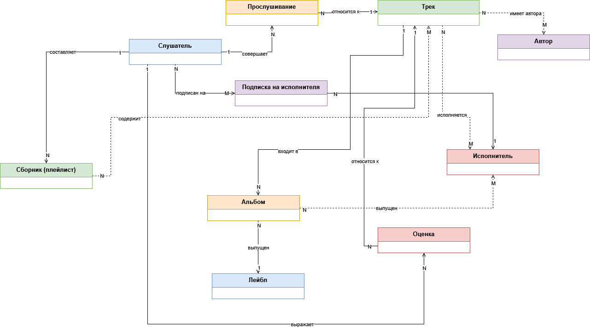
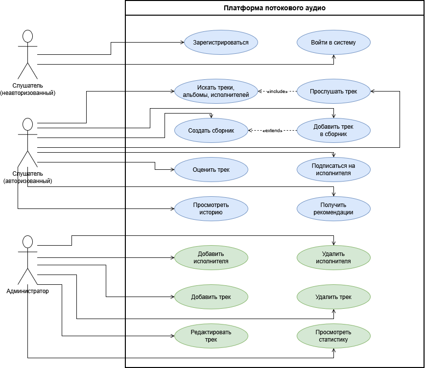

# Разработка архитектуры платформы потокового аудио на примере Spotify

## Предметная область

**Слушатель** — физическое лицо, которое слушает музыкальные произведения. В реальном мире слушатель имеет музыкальные предпочтения, историю прослушиваний (в памяти или в виде записей), может составлять списки понравившихся композиций.

**Музыкальное произведение (Трек)** — записанное аудиопроизведение. Имеет название, длительность, жанр, дату создания. Может иметь одного или нескольких авторов и исполнителей.

**Альбом** — сборник музыкальных произведений, выпущенный под общим названием. Содержит несколько треков. Может быть выпущен одним или несколькими исполнителями.

**Исполнитель** — лицо или музыкальный коллектив, создающие и/или исполняющие музыкальные произведения. Может быть автором, соавтором или только исполнителем.

**Автор** — лицо, написавшее музыкальное произведение (композитор, поэт-песенник). Один трек может иметь нескольких авторов.

**Лейбл** — компания, занимающаяся выпуском и распространением музыкальных произведений и альбомов.

**Сборник (плейлист)** — упорядоченный набор музыкальных произведений, составленный слушателем или издателем.

**Прослушивание** — факт того, что слушатель прослушал музыкальное произведение целиком или частично. Характеризуется датой, временем и длительностью.

**Оценка** — выражение отношения слушателя к музыкальному произведению (например, нравится/не нравится, оценка по шкале).

**Подписка на исполнителя** — отношение между слушателем и исполнителем, означающее желание следить за новыми релизами этого исполнителя.

### Диаграмма классов предметной области

## Прецеденты

### Диаграмма прецедентов

### Описание основных функций

#### Функции слушателя (неавторизованный доступ):
1. Слушатель может зарегистрироваться в системе (создать учётную запись)
2. Слушатель может войти в систему

#### Функции слушателя (авторизованный доступ):
3. Слушатель может искать треки, альбомы и исполнителей
4. Слушатель может прослушать трек
5. Слушатель может создать сборник (плейлист)
6. Слушатель может добавить трек в сборник
7. Слушатель может удалить трек из сборника
8. Слушатель может оценить трек (лайк/дизлайк)
9. Слушатель может изменить свою оценку трека
10. Слушатель может подписаться на исполнителя
11. Слушатель может отписаться от исполнителя
12. Слушатель может просмотреть историю своих прослушиваний
13. Слушатель может получить рекомендации на основе истории и оценок

#### Функции администратора системы:
14. Администратор может добавить нового исполнителя
15. Администратор может удалить исполнителя
16. Администратор может добавить новый трек
17. Администратор может удалить трек
18. Администратор может редактировать информацию о треке
19. Администратор может просматривать статистику прослушиваний
20. Администратор имеет доступ ко всем функциям слушателя

## Функциональные требования

### 1. Функциональные требования

1.1. Система должна предоставлять слушателю возможность регистрации по email с указанием пароля и имени.

1.2. Система должна обеспечивать аутентификацию слушателя перед доступом к персональным данным.

1.3. Система должна предоставлять поиск по трекам, альбомам и исполнителям с фильтрацией по жанру и году выпуска.

1.4. Система должна воспроизводить аудиотрек с буферизацией не более 2 секунд при стабильном соединении.

1.5. Система должна позволять слушателю создавать неограниченное количество сборников (плейлистов).

1.6. Система должна позволять добавлять треки в сборник и удалять их оттуда с сохранением порядка.

1.7. Система должна позволять слушателю ставить оценку треку (лайк или дизлайк).

1.8. Система должна предотвращать повторную оценку одного трека одним слушателем (разрешено только изменение оценки).

1.9. Система должна формировать персональные рекомендации на основе истории прослушиваний и оценок слушателя.

1.10. Система должна вести историю прослушиваний каждого слушателя с указанием даты, времени и длительности.

1.11. Система должна позволять подписываться на исполнителя и отписываться от него.

1.12. Система должна уведомлять подписанных слушателей о выходе новых треков исполнителя.

1.13. Администратор должен иметь возможность добавлять новых исполнителей.

1.14. Администратор должен иметь возможность удалять исполнителей.

1.15. Администратор должен иметь возможность добавлять новые треки с указанием исполнителя, альбома, жанра, длительности.

1.16. Администратор должен иметь возможность удалять треки.

1.17. Администратор должен иметь возможность редактировать информацию о треке.

1.18. Администратор должен иметь возможность просматривать топ-100 треков по прослушиваниям.

1.19. Система должна ограничивать доступ к функциям в соответствии с ролью (слушатель, администратор).

1.20. Система должна обеспечивать изменение рекомендательных коэффициентов без перезапуска.

## Нефункциональные требования

### 2. Нефункциональные требования

#### Пользования
2.1. Воспроизведение трека должно начинаться не более чем через 2 секунды после нажатия кнопки.

2.2. Поиск должен выдавать результаты по мере ввода с задержкой не более 0.5 секунды.

2.3. Создание сборника (плейлиста) должно выполняться не более чем за 3 действия.

2.4. Интерфейс добавления трека в сборник должен отображать все доступные сборники слушателя.

#### Надёжность
2.5. Система должна быть доступна 99.9% времени в сутки.

2.6. При обрыве соединения воспроизведение должно возобновляться с места остановки.

2.7. При сбое в процессе создания сборника система должна сохранять введённые данные.

#### Производительность
2.8. Поиск по 10 миллионам треков должен выполняться не более чем за 1 секунду.

2.9. Рекомендательная система должна формировать рекомендации за 2 секунды при 10 000 запросов.

2.10. Операция добавления трека в сборник должна выполняться не более чем за 0.5 секунды.

2.11. Операция оценки трека должна выполняться не более чем за 0.3 секунды.

#### Поддерживаемость
2.12. Система должна логировать каждое прослушивание (кто, когда, какой трек, длительность).

2.13. Система должна логировать все действия администратора с контентом.

2.14. Администратор должен изменять рекомендательные коэффициенты без перезапуска.

## Ограничения проектирования

### 3. Ограничения проектирования

#### Технологические
3.1. Система должна работать в браузере и на мобильных устройствах через единый API.

3.2. Аудиоданные должны передаваться по HTTPS с адаптивным битрейтом.

3.3. Серверная часть должна быть горизонтально масштабируемой.

#### Регуляторные
3.4. Система должна обеспечивать защиту персональных данных (ФЗ-152, GDPR).

3.5. Система должна соблюдать требования авторского права.

#### Организационные
3.6. Разработка MVP должна быть завершена за 6 месяцев командой из 4 разработчиков.

3.7. Бюджет на хранение аудиофайлов на первый год — не более 5000 $.

#### Аппаратные
3.8. Система должна работать на облачной инфраструктуре с автоматическим масштабированием.

3.9. Аудиофайлы должны храниться в объектном хранилище с CDN.

## Архитектурные мотивы системы

| Мотив | Номера требований | Обоснование |
|-------|-----------------|-------------|
| Атомарность операций с оценками | 1.7, 1.8 | Оценка трека должна применяться атомарно, исключая двойное голосование. |
| Атомарность операций со сборниками | 1.5, 1.6, 2.10 | Добавление/удаление трека из сборника должно выполняться атомарно. |
| Персональные рекомендации | 1.9, 2.9, 2.14 | Требуют отдельного сервиса рекомендаций с доступом к истории и оценкам. |
| Высокая доступность | 2.5, 2.6, 2.7 | Влияет на отказоустойчивую архитектуру (репликация, CDN, retry-политики). |
| Производительность поиска | 1.3, 2.2, 2.8 | Требует полнотекстового поиска (Elasticsearch) и кэширования. |
| Потоковое воспроизведение | 1.4, 2.1, 3.2 | Влияет на выбор протоколов (HLS, Dash) и CDN для доставки контента. |
| Модульность и масштабируемость | 3.3, 3.6, 3.8 | Требует микросервисной архитектуры. |
| Логирование и аналитика | 2.12, 2.13, 1.18 | Влияет на внедрение системы сбора событий (Kafka, ClickHouse). |
| Кроссплатформенность | 3.1, 3.4 | Требует разделения бэкенд API и фронтенд-клиентов. |
| Ролевой доступ и безопасность | 1.19, 3.4, 3.5 | Влияет на сервис авторизации, JWT-токены, защиту API. |
| Управление файлами | 1.15, 3.7, 3.9 | Влияет на выбор объектного хранилища (S3-совместимое). |